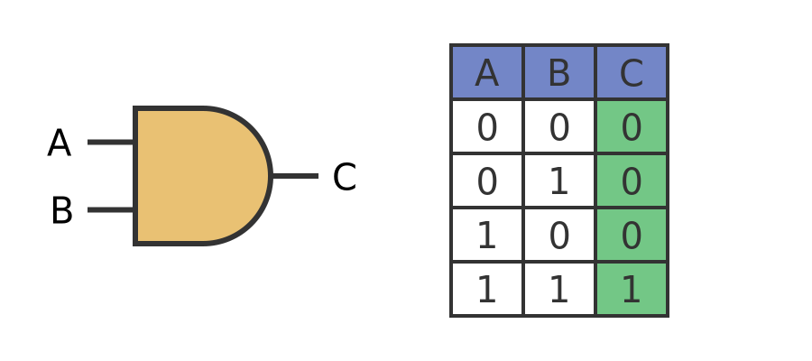
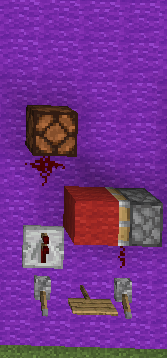
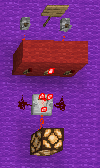
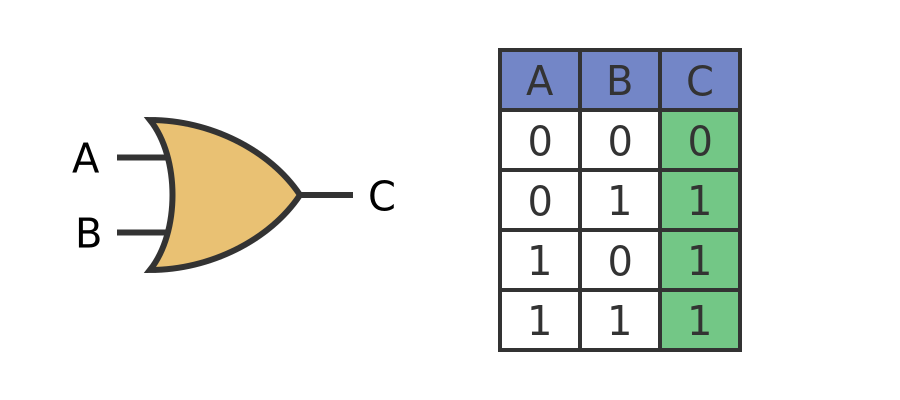
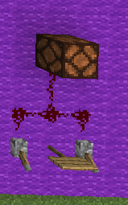
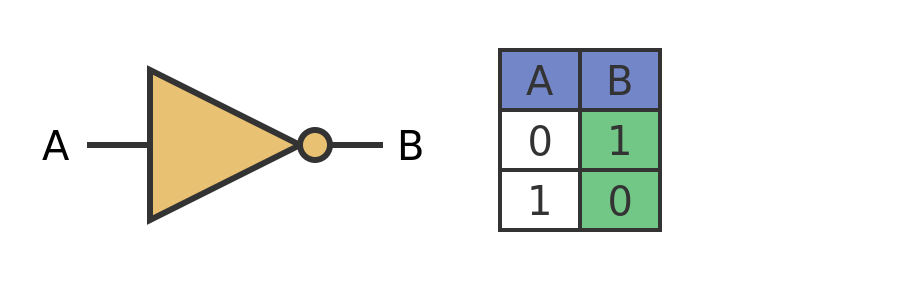
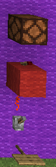

# InformatikLogbog

## Afnit 1: Tello Dronen

### Trelagsmodellen:
Præsentation: Appen og selve dronen der flyver.

Logik: Koden der får dronen til at flyve når den får et input fra appen.

Data: Gemte billeder og sensor input fra de forskellige sensorer. Den har blandt andet failsafe, collision detector og højdesensorer.

### Flyvning:
Jeg lærte at installere med pip og hvordan man kan bruge en python udvidelse til at kontrollere et objekt i virkeligheden.

### Projekt:
Vi er begyndt på et projekt. Min gruppe er Abdullah, Halfdan og mig. Vi har besluttet at vi vil prøve at lave et program der kan følge efter en person.

## Afsnit 2: Kryptering

### RCS Kryptering:
RCS Kryptering er en moderne form for kryptering der indvolvere at hver person har to nøgler. Afsenderen bruger modtagerens public key til at enkryptere beskeden. Modtageren bruger sin private key til at dekryptere beskeden. Der er altså en sammenhæng mellem de 2 keys. Public key'en er en sammensætning af to store primtal ganget sammen plus noget mere snask. På grund af måden computere laver matematik på vil det være pretty much umulig at gennemskue. Public key'en kan derfor sendes rundt frit på internettet så andre kan kryptere beskeder de sender til dig.

### Synkronkryptering:
En gammeldags form for kryptering hvor begge parter gjorde de samme steps for at enkryptere og dekryptere. Skal begge kende krypteringen for at kunne dekryptere. F.eks "ABC" med krypteringen +3 ville være "DEF".

## Afsnit 3: De Danske Cybermesterskaber

### Read the rules
Skulle ind på en hjemmeside i virtual lab for at finde første del og ind i regler og finde sidste del. Jeg lærte at bruge virtual lab og DDC.

### Straba (Image Metadata)
"Vi er på udkig efter nogle soldater som er fra den fjendtlige styrke. Vi har fået et tip om at de bruger straba til at poste deres løb. Straba har dog en politik om at udlevere 0 information og vi må derfor se om vi kan finde noget selv. Gå ind på straba.hkn og se om du kan finde noget i billederne."
Efter længere tids søgning fandt jeg ud af at jeg ved at downloade billedet kunne få adgang til metadaten hvor jeg fandt byen som militær basen ligger i.

## Afsnit 4: Terminal og Cybersecurity
Alle features der ikke behøver en brugergrænseflade (GUI) ligger i terminalen, ofte er de kun nødvendige for avancerede brugere.

### Sårbarheder
#### Responsible disclosure
Når man rapportere en bug og/eller sikkerheds hul til et firma. Oftest ville man få en bug-bounty for at finde dette hul. **Gælder ikke hvis det er Aarhus-tech**
#### CVE
Hver fejl får et CVE nr der refere til den sårbarhed.
#### HTTP
Bruger port 80.
#### HTTPS
Bruger krypteret port 443.
#### Porte
1 service på en port af gangen. Der er 65535 porte.
#### nmap
Kommando i cmd der returnere åbne porte for specificerede hjemmeside.
#### Netcat (ncat)
Er en del af nmap
Kan modtage den tekst et program modtager og printe det i terminalen.
Netcat kan lytte på en bestemt port (netcat listen "ncat -l *port*") Det er en TCP forbindelse
Kan bruges som en ret basal besked service.

### OSI
Lag 1: Fysisk hvordan sidder det sammen med ledninger osv.

Lag 2: Data link: Devices på samme netværk. Håndtere node to node data transfer.

Lag 3: Network: Devices og andre ting på andet netværk, finder mest effektive rute til andet device.

Lag 4: Transport: Bruger UDP og TCP til at sende data mellem devices.

Lag 5: Session: Håndtere de forskellige sessioner melem devices.

Lag 6: Presentation: Presentere den data den modtager til en fil eller et input som computeren kan lave til filer.

Lag 7: Application: Viser modtaget data til brugeren som et visuelt resultat.

### SQL
Man kan ved at skrive specifikke termer ind i søgefeltet fremtvinge information på hjemmesiden der ikke skulle være tilgængeligt til dig. Det sker fordi at databasen man hiver fra altid vil returnere noget og hvis bestemte termer er opfyldt. Ved at opfylde disse termer uden at specificere hvilken inddividuel data pakke du vil have adgang til, kan du få alt retur.

### Teachable Machine
En maskine der bliver lært i at genkende forskellige trænede grupper.

## År 2: Afsnit 1: It system
### Server client forbindelse
Server udstiller endpoints der giver clients muligheder for at lagre og læse data. (API)
API kaldes ved nogle kommandoer (Get, put, post, store)

"Smuk måde at sende data er JSON" - Mark

Trelagsmodellen på API: 
Præsentation: Ikke sygt meget eksiterende. Eksitere pretty much kun til programmøren

Logik: 

Data:

### Databaser
#### Normalformer
Normalform 1: Alle attributter skal dække over enkle værdier. Altså må der ikke være flere værdier i samme felt.
Normalform 2: 
Normalform 3: 

## Afsnit 5: Logic Gates
### Forskellige former for logic gates
Logic gates bliver brugt i computere til at bestemme hvilken handling den udføre alt efter det input den modtager. Det virker ved at bruge boolean variables som f.eks. True/False, 1/0, High/Low disse har kun 2 værdier at skifte i mellem og dette kan vi gøre ved at ændre spændingen i et kredsløb. Man kan opskrive truth tables for de forskellige input og de tilsvarende output værdier for hver gate.
Der findes mange forskellige gates men de basale er følgende:
#### AND Gate
 En AND gate fungere sådan at hvis både input A og B er sandt er output C sandt. Neden for er truth table og symbol
 
 
 Som en udfordring valgte jeg at samarbejde med Emil, Halfdan og Emre om at skabe gaten i Minecraft med redstone. Her kom vi frem til 2 designs der er tilføjet nedenunder.
 
 
 

 #### OR Gate
 En OR gate fungere sådan at hvis enten input A eller B er sandt er output C sandt. Neden for er truth table og symbol
  
 
 Denne gate genskabte vi også i Minecraft.
 
 
 

 #### NOT Gate
 En Not gate fungere ved at invertere signalet den få som input. Hvis input A er 1 sandt er output B falsk og omvendt.

  
 
 Denne genskabte vi også i Minecraft.

 

#### NAND

#### NOR

#### XOR

#### XNOR

